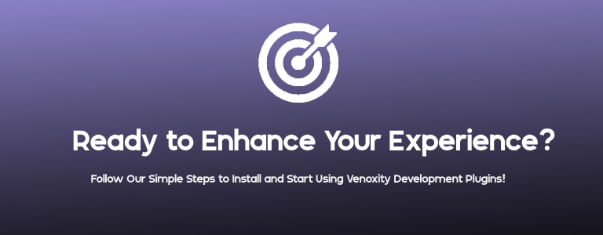

# Quickstart

<figure><figcaption></figcaption></figure>

In this article, I’ll guide you through how to get started with Venoxity Development plugins to enhance your **GTA V** experience. You will learn how to **download** and **install** each plugin for seamless integration.


If you're already a **user of our plugins** and have them **installed**, you can skip to the [**Essential Knowledge**](../basics/essential-knowledge.md) section for **advanced tips** and **updates**.


## ExtraManager

Effortless Control Over Vehicle Extras

## LicensePlateChanger

Switch Plates, Change Fate: LPC

## SimpleCTRL

Simplifying Vehicle Functions: Control, Customize, Conquer with SimpleCTRL.

## SimpleHUD

Seamlessly display your location, compass, and time in-game

## WeaponControl

Keep your friends close and your weapons under lock and key: because even guns need a timeout!
