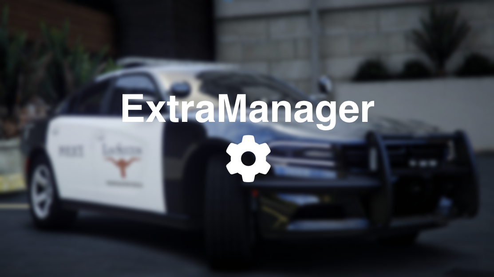
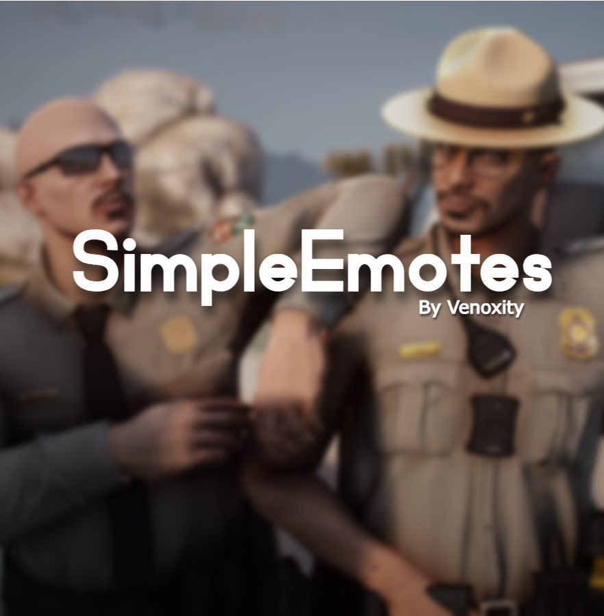
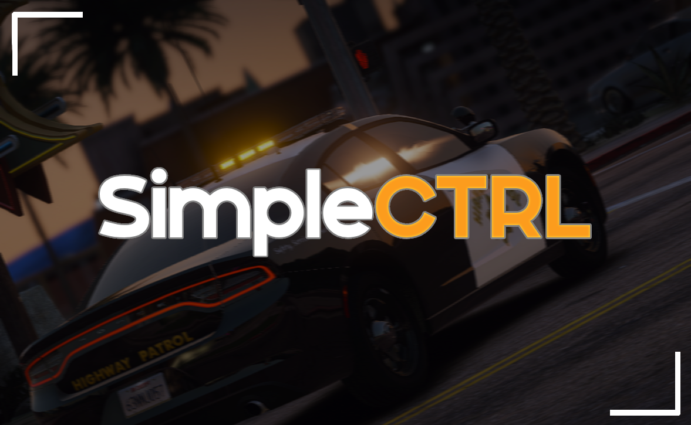
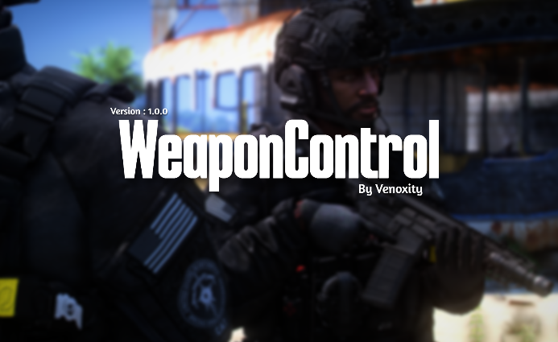

# Quickstart

<figure><figcaption></figcaption></figure>

In this article, I’ll guide you through how to get started with Venoxity Development plugins to enhance your **GTA V** experience. You will learn how to **download** and **install** each plugin for seamless integration.


If you're already a **user of our plugins** and have them **installed**, you can skip to the [**Essential Knowledge**](../basics/essential-knowledge.md) section for **advanced tips** and **updates**.


## [ExtraManager](../plugins/extramanager/README.md)  

  <figure>
    
    <figcaption></figcaption>
  </figure>

Customize GTA V vehicle extras exactly how you want—every time, with XML.

## [LicensePlateChanger](../plugins/licenseplatechanger/README.md)  

  <figure>
    </figcaption>
  </figure>

Bring variety and realism to GTA V with smart license plate customization.

## [SimpleEmotes](../plugins/simpleemotes/README.md)  

  <figure>
    
    <figcaption></figcaption>
  </figure>

Easy emotes, smooth moves—better expression in GTA V.

## [SimpleCTRL](../plugins/simplectrl/README.md)  

  <figure>
    
    <figcaption></figcaption>
  </figure>

Realistic vehicle control and immersive driving—built right into GTA V.

## [SimpleHUD](../plugins/simplehud/README.md)  

  <figure>
    
    <figcaption></figcaption>
  </figure>

Location, compass, and time—always visible, never distracting.

## [WeaponControl](../plugins/weaponcontrol/README.md)  

  <figure>
    
    <figcaption></figcaption>
  </figure>

Enhanced weapon mechanics for a more realistic GTA V combat experience.
